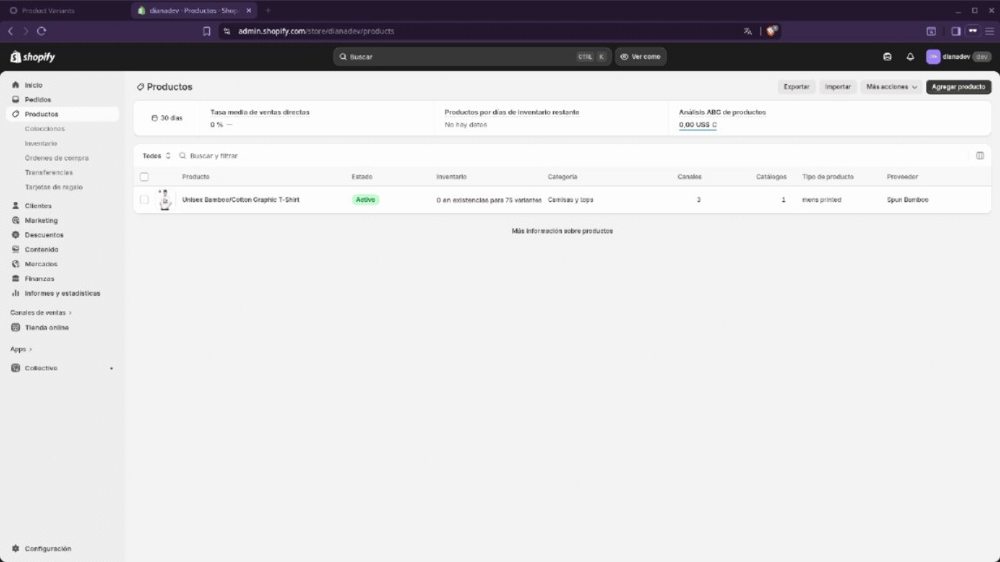

============================
Shopify Product Synchronizer
============================
.. |badge| image:: https://img.shields.io/badge/licence-AGPL--3-blue.png
    :target: http://www.gnu.org/licenses/agpl-3.0-standalone.html
    :alt: License: AGPL-3

|badge|

This module focuses on product synchronization with Shopify. Each product import is processed 
individually in the background through asynchronous jobs using the connector framework from the
Odoo Community Association. This approach avoids running long transactional processes in the 
foreground, improving scalability and reducing the impact on server performance.

Demo
====

Vídeo completo:

`Ver demo en YouTube <https://www.youtube.com/watch?v=vqRi7OO4-jw>`_

Author
------------

Diana C. Rojas R.

Maintainer
----------

Diana C. Rojas R.
